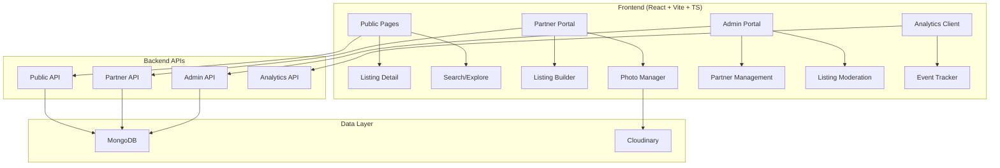

# Design Document

## Overview

This design document outlines the architecture and implementation approach for upgrading the existing workspace listing platform to a premium, industry-leading solution. The platform will maintain the current React + Vite + TypeScript + Tailwind CSS stack while implementing significant UI/UX improvements, enhanced functionality, and better user experience that surpasses Innov8's interface quality.

The design focuses on Phase 1 deliverables: Premium Listing Detail Page, Enhanced Partner Portal, Admin Portal improvements, Industry-grade Search, and Analytics implementation. All changes will integrate seamlessly with the existing MongoDB backend and Cloudinary photo storage.

## Architecture

### High-Level Architecture



### Component Architecture

The application follows a layered component architecture:

1. **Page Components**: Route-level components handling data fetching and layout
2. **Feature Components**: Business logic components (ListingDetail, OfferingEditor, etc.)
3. **UI Components**: Reusable design system components (existing shadcn/ui)
4. **Utility Components**: Cross-cutting concerns (Analytics, Auth, etc.)

### State Management

- **React Query**: Server state management and caching
- **React Context**: Authentication state and user session
- **Local State**: Component-level state with useState/useReducer
- **URL State**: Search filters and navigation state via React Router

## Components and Interfaces

### Core Components

#### 1. Premium Listing Detail Page

**ListingDetailPage Component**
```typescript
interface ListingDetailPageProps {
  slug: string;
}

interface ListingDetailData {
  slug: string;
  displayName: string;
  locality: string;
  city: string;
  verificationStatus: 'verified' | 'pending' | 'rejected';
  offerings: OfferingData[];
  location: LocationData;
  amenities: string[];
  photos: string[];
  overview: string;
}

interface OfferingData {
  type: 'private-offices' | 'dedicated-desks' | 'hot-desks' | 'meeting-rooms' | 'event-spaces';
  title: string;
  description: string;
  features: string[];
  startingPrice?: number;
  unit?: 'month' | 'hr' | 'NA';
  budgetBand?: string;
  photos: string[];
  enabled: boolean;
}
```

**Layout Structure:**
- Desktop: CSS Grid with `grid-template-columns: 1fr 400px`
- Mobile: Single column with sticky bottom CTA
- Scroll-spy navigation with IntersectionObserver
- Smooth scrolling with `scroll-behavior: smooth`

#### 2. Enhanced Search Interface

**SearchPage Component**
```typescript
interface SearchFilters {
  locality: string[];
  teamSize: string;
  budgetBand: string[];
  meetingRooms: boolean;
  privateOffice: boolean;
  verifiedOnly: boolean;
  amenities: string[];
}

interface SearchState {
  query: string;
  filters: SearchFilters;
  sort: 'recommended' | 'most-enquired' | 'budget-low';
  page: number;
}
```

**Features:**
- Debounced search with 300ms delay
- URL synchronization using URLSearchParams
- Skeleton loading states during fetch
- Infinite scroll or pagination
- Filter persistence in localStorage

#### 3. Partner Listing Builder

**ListingBuilder Component**
```typescript
interface ListingBuilderState {
  step: 'basic-info' | 'offerings' | 'location';
  data: ListingFormData;
  isDraft: boolean;
  validationErrors: Record<string, string>;
}

interface ListingFormData {
  basicInfo: BasicInfoData;
  offerings: Record<OfferingType, OfferingFormData>;
  location: LocationFormData;
}

interface OfferingFormData extends OfferingData {
  photos: File[];
  uploadProgress: Record<string, number>;
}
```

**Photo Upload System:**
- Multi-file upload with drag-and-drop
- Progress tracking per file
- Thumbnail preview with reorder/delete
- Cloudinary integration with existing API
- Validation: minimum 1 photo per enabled offering

#### 4. Analytics System

**Analytics Client**
```typescript
interface AnalyticsEvent {
  eventName: string;
  timestamp: number;
  userId?: string;
  userRole: 'anon' | 'partner' | 'admin';
  listingId?: string;
  listingSlug?: string;
  referrer?: string;
  path: string;
  metadata?: Record<string, any>;
}

class AnalyticsClient {
  private eventQueue: AnalyticsEvent[] = [];
  private batchSize = 10;
  private flushInterval = 5000; // 5 seconds
  
  track(eventName: string, metadata?: Record<string, any>): void;
  flush(): Promise<void>;
  private sendBatch(events: AnalyticsEvent[]): Promise<void>;
}
```

### Utility Components

#### 1. Slug Management

```typescript
interface SlugUtils {
  generateSlug(partner: string, locality: string, name: string): string;
  generateHashSuffix(listingId: string): string;
  resolveSlugCollision(baseSlug: string, listingId: string): string;
}

// Implementation
function slugify(text: string): string {
  return text
    .toLowerCase()
    .replace(/[^a-z0-9]+/g, '-')
    .replace(/^-+|-+$/g, '');
}

function generateHashSuffix(listingId: string): string {
  // Use crypto.subtle.digest or a lightweight hash library
  return sha256(listingId).substring(0, 6);
}
```

#### 2. Price Display Logic

```typescript
interface PriceDisplayProps {
  startingPrice?: number;
  unit?: 'month' | 'hr' | 'NA';
  budgetBand?: string;
}

function formatPrice({ startingPrice, unit, budgetBand }: PriceDisplayProps): string {
  if (startingPrice && unit) {
    return `Starting ₹${startingPrice.toLocaleString()} / ${unit}`;
  }
  if (budgetBand) {
    return `Budget ${budgetBand}`;
  }
  return 'On enquiry';
}
```

## Data Models

### Enhanced Listing Model

```typescript
interface Listing {
  // Core identification
  listingId: string;
  slug: string;
  partnerId: string;
  
  // Basic information
  displayName: string;
  locality: string;
  city: string;
  overview: string;
  
  // Status and verification
  status: 'draft' | 'submitted' | 'approved' | 'rejected' | 'published';
  verificationStatus: 'verified' | 'pending' | 'rejected';
  
  // Offerings (5 types)
  offerings: {
    privateOffices: OfferingData;
    dedicatedDesks: OfferingData;
    hotDesks: OfferingData;
    meetingRooms: OfferingData;
    eventSpaces: OfferingData;
  };
  
  // Location (privacy-protected)
  location: {
    locality: string;
    city: string;
    approximateCoordinates?: {
      lat: number; // rounded to 2 decimal places
      lng: number; // rounded to 2 decimal places
    };
  };
  
  // Metadata
  amenities: string[];
  capacity: {
    min: number;
    max: number;
  };
  
  // Timestamps
  createdAt: string;
  updatedAt: string;
  publishedAt?: string;
}
```

### Analytics Data Model

```typescript
interface AnalyticsEvent {
  eventId: string;
  eventName: 'listing_view' | 'enquiry_submit' | 'whatsapp_click' | 'call_click' | 
           'search_performed' | 'filter_applied' | 'partner_signup' | 'partner_listing_submitted';
  timestamp: number;
  
  // User context (no PII)
  sessionId: string;
  userRole: 'anon' | 'partner' | 'admin';
  
  // Content context
  listingId?: string;
  listingSlug?: string;
  
  // Navigation context
  referrer?: string;
  path: string;
  
  // Event-specific metadata
  metadata?: {
    searchQuery?: string;
    filtersApplied?: string[];
    enquiryType?: string;
    offeringType?: string;
  };
}

interface AnalyticsSummary {
  totalViews: number;
  totalEnquiries: number;
  conversionRate: number;
  topListings: Array<{
    listingId: string;
    displayName: string;
    views: number;
    enquiries: number;
  }>;
  topLocalities: Array<{
    locality: string;
    searches: number;
    views: number;
  }>;
}
```

## Correctness Properties

*A property is a characteristic or behavior that should hold true across all valid executions of a system—essentially, a formal statement about what the system should do. Properties serve as the bridge between human-readable specifications and machine-verifiable correctness guarantees.*

Based on the prework analysis, here are the key correctness properties that will ensure the system behaves correctly:

### Property 1: Responsive Layout Consistency
*For any* viewport size, the listing detail page should display the appropriate layout: 2-column with sticky enquiry card on desktop (≥768px) and single column with bottom CTA bar on mobile (<768px)
**Validates: Requirements 1.1, 1.2**

### Property 2: Listing Title Format Consistency
*For any* listing data, the title should always be formatted as "{displayName}, {locality}" and subtitle as "{locality}, {city}" with verification badge displayed if and only if verificationStatus is "verified" or "approved"
**Validates: Requirements 1.3**

### Property 3: Offering Count Invariant
*For any* listing detail page, exactly 5 offering sections should be rendered corresponding to: Private Offices, Dedicated Desks, Hot Desks, Meeting Rooms, Event Spaces
**Validates: Requirements 1.6, 2.1**

### Property 4: Price Display Logic Consistency
*For any* offering with pricing data, the price display should follow the hierarchy: if startingPrice exists show "Starting ₹X / {unit}", else if budgetBand exists show "Budget {band}", else show "On enquiry"
**Validates: Requirements 2.4, 2.5, 2.6**

### Property 5: Location Privacy Protection
*For any* location display in public interfaces, exact address text should never be shown, and map coordinates should be rounded to maximum 2 decimal places
**Validates: Requirements 1.8, 7.1, 7.3**

### Property 6: Slug Generation Consistency
*For any* listing data, the generated slug should follow the format "/listing/{partnerSlug}/{localitySlug}/{nameSlug}" where each component is URL-safe (lowercase, alphanumeric with hyphens)
**Validates: Requirements 3.1, 3.3**

### Property 7: Slug Collision Resolution
*For any* slug collision scenario, the system should append a deterministic 6-character hash suffix derived from the listingId, ensuring uniqueness while maintaining determinism
**Validates: Requirements 3.2, 3.4**

### Property 8: Photo Validation Enforcement
*For any* listing submission attempt, the "Submit for Approval" action should be blocked if any enabled offering has fewer than 1 photo uploaded
**Validates: Requirements 2.8, 4.7**

### Property 9: Partner Authorization Consistency
*For any* partner user, listing creation and management features should be accessible if and only if their account status is "approved" or "active"
**Validates: Requirements 4.1, 4.2, 9.4**

### Property 10: Search Filter URL Synchronization
*For any* search filter state change, the URL query parameters should be updated to reflect the current filters, and conversely, URL parameter changes should update the filter state
**Validates: Requirements 5.4**

### Property 11: Analytics Event Structure Consistency
*For any* tracked analytics event, the event data should include timestamp, userRole, path, and when applicable, listingId/slug, with no personally identifiable information (PII)
**Validates: Requirements 6.1, 6.2**

### Property 12: Authentication State Persistence
*For any* valid JWT session, the authentication state should persist across page reloads and navigation, and expired sessions should trigger redirect to appropriate login page
**Validates: Requirements 9.5, 9.6, 9.7**

### Property 13: Form Validation Real-time Feedback
*For any* form field with validation rules, error messages should appear in real-time as the user types, and submission should be blocked until all validation passes
**Validates: Requirements 10.1, 10.2, 10.4**

### Property 14: Upload Progress Non-blocking
*For any* photo upload operation, the UI should remain responsive and show progress indicators without blocking user interaction with other interface elements
**Validates: Requirements 11.3, 4.4**

### Property 15: Design System Consistency
*For any* UI component, it should use design tokens from the established system for colors, spacing, typography, and shadows to maintain visual consistency
**Validates: Requirements 8.1, 8.2, 8.6**

## Error Handling

### Client-Side Error Handling

**Network Errors**
- Implement retry logic with exponential backoff for failed API requests
- Display user-friendly error messages with retry options
- Graceful degradation when backend services are unavailable
- Offline detection and appropriate messaging

**Validation Errors**
- Real-time form validation with Zod schemas
- Inline error messages with specific guidance
- Prevention of invalid form submissions
- Clear error state recovery paths

**Authentication Errors**
- Automatic token refresh for expired sessions
- Redirect to login on authentication failures
- Clear session state on logout
- Handle concurrent session scenarios

**Photo Upload Errors**
- Individual file upload error handling
- Progress tracking with error states
- Retry mechanisms for failed uploads
- File size and type validation

### Error Boundaries

```typescript
interface ErrorBoundaryState {
  hasError: boolean;
  error?: Error;
  errorInfo?: ErrorInfo;
}

class FeatureErrorBoundary extends Component<PropsWithChildren, ErrorBoundaryState> {
  // Catch JavaScript errors in component tree
  // Log errors to analytics system
  // Display fallback UI with recovery options
}
```

### API Error Handling

**Structured Error Responses**
```typescript
interface ApiError {
  status: number;
  code: string;
  message: string;
  details?: Record<string, any>;
  timestamp: string;
}

// Error handling middleware
function handleApiError(error: ApiError): UserFriendlyError {
  switch (error.status) {
    case 400: return { message: "Please check your input and try again" };
    case 401: return { message: "Please log in to continue", action: "redirect-login" };
    case 403: return { message: "You don't have permission for this action" };
    case 404: return { message: "The requested item was not found" };
    case 422: return { message: "Please fix the highlighted errors", details: error.details };
    case 500: return { message: "Something went wrong. Please try again later" };
    default: return { message: "An unexpected error occurred" };
  }
}
```

## Testing Strategy

### Dual Testing Approach

The testing strategy employs both unit testing and property-based testing to ensure comprehensive coverage:

**Unit Tests**: Verify specific examples, edge cases, and error conditions
- Component rendering with specific props
- User interaction scenarios
- API integration points
- Error boundary behavior
- Authentication flows

**Property Tests**: Verify universal properties across all inputs
- Form validation with generated data
- Slug generation with random inputs
- Price display logic with various pricing combinations
- Responsive layout behavior across viewport sizes
- Analytics event structure consistency

### Property-Based Testing Configuration

**Testing Library**: Use `fast-check` for TypeScript property-based testing
**Test Configuration**:
- Minimum 100 iterations per property test
- Custom generators for domain-specific data (listings, users, etc.)
- Shrinking enabled for minimal counterexamples
- Deterministic seeds for reproducible test runs

**Property Test Structure**:
```typescript
import fc from 'fast-check';

describe('Premium Workspace Platform Properties', () => {
  it('Property 1: Responsive Layout Consistency', () => {
    fc.assert(fc.property(
      fc.integer({ min: 320, max: 2560 }), // viewport width
      (viewportWidth) => {
        // Test: Feature: premium-workspace-platform, Property 1: Responsive Layout Consistency
        const layout = getLayoutForViewport(viewportWidth);
        if (viewportWidth >= 768) {
          expect(layout.type).toBe('two-column');
          expect(layout.enquiryCard.position).toBe('sticky');
        } else {
          expect(layout.type).toBe('single-column');
          expect(layout.ctaBar.position).toBe('bottom-sticky');
        }
      }
    ), { numRuns: 100 });
  });

  it('Property 6: Slug Generation Consistency', () => {
    fc.assert(fc.property(
      fc.record({
        partner: fc.string({ minLength: 1, maxLength: 50 }),
        locality: fc.string({ minLength: 1, maxLength: 50 }),
        name: fc.string({ minLength: 1, maxLength: 100 })
      }),
      (data) => {
        // Test: Feature: premium-workspace-platform, Property 6: Slug Generation Consistency
        const slug = generateSlug(data.partner, data.locality, data.name);
        expect(slug).toMatch(/^\/listing\/[a-z0-9-]+\/[a-z0-9-]+\/[a-z0-9-]+$/);
        expect(slug).not.toContain('--'); // No double hyphens
        expect(slug).not.toMatch(/^-|-$/); // No leading/trailing hyphens
      }
    ), { numRuns: 100 });
  });
});
```

### Unit Testing Focus Areas

**Component Testing**:
- ListingDetailPage with various listing states
- OfferingEditor with different offering configurations
- SearchPage with filter combinations
- PhotoUploader with success/error scenarios

**Integration Testing**:
- Authentication flows (login, logout, session refresh)
- API client with mock responses
- Router navigation and route guards
- Analytics event tracking

**Accessibility Testing**:
- Keyboard navigation
- Screen reader compatibility
- Color contrast compliance
- Focus management

### Test Data Management

**Factories and Fixtures**:
```typescript
// Test data factories
const createListing = (overrides?: Partial<Listing>): Listing => ({
  listingId: faker.string.uuid(),
  slug: faker.lorem.slug(),
  displayName: faker.company.name(),
  locality: faker.location.city(),
  city: 'Delhi',
  ...overrides
});

const createOffering = (type: OfferingType, overrides?: Partial<OfferingData>): OfferingData => ({
  type,
  title: getOfferingTitle(type),
  description: faker.lorem.paragraph(),
  features: faker.helpers.arrayElements(COMMON_FEATURES, { min: 2, max: 5 }),
  enabled: true,
  photos: [],
  ...overrides
});
```

**Mock API Responses**:
- Consistent mock data across tests
- Error scenario simulation
- Loading state testing
- Edge case data (empty results, malformed responses)

### Performance Testing

**Metrics to Monitor**:
- Initial page load time
- Time to interactive
- Largest contentful paint
- Cumulative layout shift
- Bundle size analysis

**Testing Approach**:
- Lighthouse CI integration
- Bundle analyzer reports
- Performance regression detection
- Memory leak detection in long-running sessions

### End-to-End Testing Strategy

**Critical User Journeys**:
1. Customer discovers and enquires about workspace
2. Partner registers, gets approved, and creates listing
3. Admin moderates partners and listings
4. Search and filtering workflows
5. Photo upload and management

**Testing Tools**:
- Playwright for cross-browser testing
- Visual regression testing
- Mobile device testing
- Network condition simulation

This comprehensive testing strategy ensures both functional correctness through property-based testing and user experience quality through traditional unit and integration testing approaches.